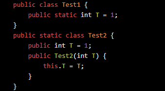
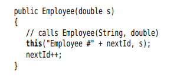
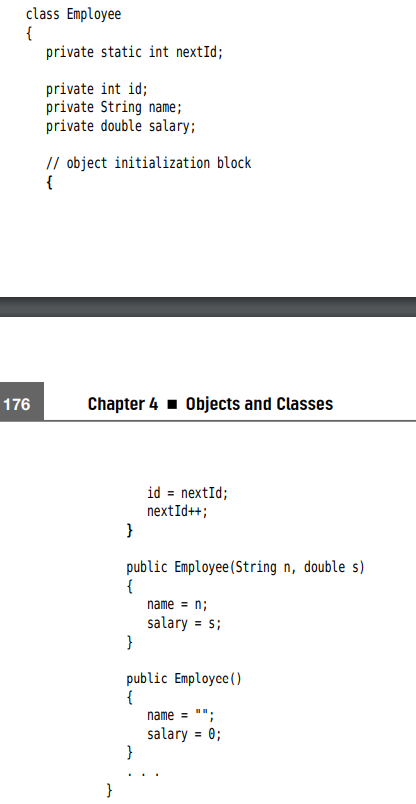

## Benefit of Encapsulation
- Private attributes cannot be freely altered outside of class. They can only be accessed via **Accessor** and changed via **Mutator**. By doing this way, we can:
    - **Centralized handling**: Handle error handling at one centralized place
    - **Debugging with ease**: If errors happen, we only need to look at the class

- Accessor must always return clone of mutable object to avoid modification from outside

## Static fields and methods
- There can only be **one** static field in a class
- Static field belongs to the Class, not the Object
- Static methods can only called static fields (makes sense)

## Main methods
- Main method is called if we execute a file
- Any class can have a Main method

## Method parameter
- Java parameter is **called by value** (similar to Python)

## Object construction
### Overloading
- We can have multiple constructor in a class. Java will try to match data type and number of provided parameter to a constructor. Compile time error is thrown if Java cannot find a match
### Default-field initialization
- If a class doesn't have a constructor when we init an object, all fields are set to default (0 for int, false for boolean, null for object)
- If a class have at least one constructor, the class loses the above free default constructor
- We can assign value to fields during its declaration for default value initialization. Test1 as an example

- Test2 example will not work because we already have a constructor
- We can call a constructor within a constructor by using keyword this

### Initilization block
- Init block will be called first before constructor is called
- This method is not common. But if all Constructors have some line in common, we can do refactoring this way
